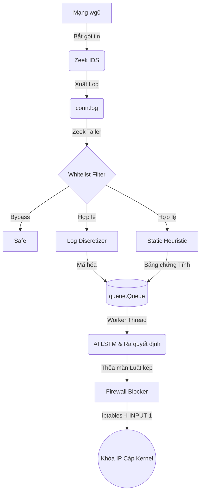

# 🛡️ Mini AI VPN Gateway (AIVPN)

<p align="center">
  
  
  
  
</p>


---

## 📝 Mục lục (Table of Contents)
1. [Giới thiệu tổng quan (Overview)](#-1-gioi-thieu-tong-quan-overview)
2. [Kiến trúc hệ thống (Core Architecture)](#-2-kien-truc-he-thong-core-architecture)
3. [Bộ ba "Thợ săn" lớp 3 (Detection Modules)](#-3-bo-ba-tho-san-lop-3-detection-modules)
4. [Lớp Bồi thẩm đoàn & Luật kép lớp 4 (Evidence Manager)](#-4-lop-boi-tham-doan--luat-kep-lop-4-evidence-manager)
5. [Hướng dẫn Cài đặt & Sử dụng (Quick Start)](#-5-huong-dan-cai-dat--su-dung-quick-start)
6. [Kịch bản Kiểm thử Tích hợp (Testing Scenarios)](#-6-kich-ban-kiem-thu-tich-hop-testing-scenarios)

---

## 📖 1. Giới thiệu tổng quan (Overview)

**Mini AI VPN Gateway (AIVPN)** là một hệ thống **Phát hiện và Ngăn chặn Xâm nhập (IPS/IDS)** biên thời gian thực siêu nhẹ, được thiết kế chuyên biệt để bảo vệ các cổng ngõ VPN (**WireGuard Gateway**) khỏi các mối đe dọa tàng hình (**Stealth APT**). 

Hệ thống kết hợp sức mạnh phân tích mạng nơ-ron nhân tạo (**AI**) và các thuật toán dò tìm theo quy tắc (**Heuristic**), giúp chủ động bóc tách, phát hiện và vô hiệu hóa các luồng C2 Botnet, Port Scan và rò rỉ dữ liệu qua DNS với mức tiêu thụ tài nguyên tối giản.

---

## 🏗️ 2. Kiến trúc hệ thống (Core Architecture)

AIVPN vừa trải qua đợt đại tu kiến trúc toàn diện: tích hợp lõi Zeek, chuyển đổi luồng xử lý và kiểm soát tường lửa cấp Kernel.

### A. Kiến trúc Bằng chứng (Evidence-based)
Lấy cảm hứng từ hệ thống *Stratosphere Slips*, AIVPN tuân thủ nghiêm ngặt nguyên lý tách biệt:
*   **Lớp Phát hiện:** Chỉ làm nhiệm vụ sinh ra **Bằng chứng** (chứa IP, tội danh, điểm số rủi ro).
*   **Lớp Ra quyết định:** Bồi thẩm đoàn tích lũy bằng chứng và đưa ra **Phán quyết** cuối cùng.

### B. Cơ chế Bất đồng bộ (Producer-Consumer Queue)
Để giải quyết triệt để nút thắt cổ chai **Blocking I/O** khi lưu lượng log mạng đột biến:
*   Hệ thống sử dụng hàng đợi `queue.Queue` đa luồng.
*   **Luồng đọc log (Tailer / Producer):** Liên tục đọc log Zeek thời gian thực, bóc tách và đẩy vào hàng đợi mà không bị nghẽn.
*   **Luồng AI (Worker / Consumer):** Âm thầm rút dữ liệu từ hàng đợi để chạy suy luận Deep Learning dưới nền.

### C. Sơ đồ Luồng xử lý (Pipeline Diagram)



---

## 🕵️ 3. Bộ ba "Thợ săn" lớp 3 (Detection Modules)

Lớp 3 tích hợp ba module hoạt động song song để bao quát toàn diện các vector tấn công mạng:

### I. AI LSTM Core
*   **Cơ chế:** Sử dụng Deep Learning phân tích chuỗi thời gian với cửa sổ trượt (Sliding Window) `maxlen=20`.
*   **Chức năng:** Chuyên nhận diện các nhịp điệu máy móc (**Suspicious Rhythm**) để bắt quả tang các luồng **C2 Beaconing** tàng hình có che đậy bằng Jitter.

### II. Static Scan Detector
*   **Cơ chế:** Bộ đếm tần suất hoạt động tĩnh trong thời gian thực.
*   **Chức năng:** Báo động ngay lập tức khi phát hiện một IP nguồn quét vượt ngưỡng **10 cổng đích / 10 giây**.

### III. DNS Detector
*   **Phát hiện DGA:** Dựa trên toán học xác suất để bắt mã độc tự động sinh tên miền (khi **Shannon Entropy > 4.2**).
*   **Phát hiện Tunneling:** Bóc tách FQDN để đánh chặn nỗ lực rò rỉ dữ liệu (khi **Subdomain > 45 ký tự**).
*   **Lưu ý Kiến trúc:** Chúng tôi đã viết một custom script Zeek (`local.zeek`) để tự động gộp truy vấn DNS thẳng vào cột `query` của file `conn.log`, giúp tối ưu hóa triệt để luồng đọc log của AI.

---

## ⚖️ 4. Lớp Bồi thẩm đoàn & Luật kép lớp 4 (Evidence Manager)

**EvidenceManager** là bộ não tiếp nhận các bằng chứng rời rạc, đối chiếu với hồ sơ IP và ra lệnh chém đứt kết nối.

### A. Lọc rác bằng chứng (Time-To-Live)
Để tránh tốn RAM và phán quyết sai do tích lũy vô hạn, mọi bằng chứng đều có cơ chế hết hạn (**TTL = 5 phút**). Nếu IP ngừng tấn công, hệ thống sẽ tự động đào thải bằng chứng cũ và "tha bổng" cho IP đó.

### B. Hệ thống Luật kép (Dual-Rule System)
Hệ thống kiểm duyệt dựa trên hai quy tắc song song cực kỳ chặt chẽ:

> [!NOTE]
> **1. Luật Đồng thuận (Consensus Rule)**
> Áp dụng cho các đợt tấn công Stealth APT cường độ nhỏ. Bồi thẩm đoàn sẽ cộng dồn điểm tự tin (Confidence). Nếu tổng điểm tích lũy **$\ge 1.50$**, khóa IP lập tức.
> *(Ví dụ: Suspicious Domain 0.70 + Jitter Beaconing 0.82 = 1.52 $\rightarrow$ BLOCK)*

> [!IMPORTANT]
> **2. Luật Phủ quyết Khẩn cấp (Critical Bypass)**
> Nếu xuất hiện bất kỳ bằng chứng nào có mức nguy hiểm trí mạng (**$\ge 0.85$**), khóa IP lập tức mà không cần chờ đồng thuận.
> *(Ví dụ: DNS DGA Malware có điểm 0.85 $\rightarrow$ BLOCK)*

---

## 🚀 5. Hướng dẫn Cài đặt & Sử dụng (Quick Start)

### A. Yêu cầu hệ thống
*   Python **3.8+**
*   TensorFlow Lite (`tflite_runtime`)
*   Zeek IDS (Đã cấu hình `local.zeek`)
*   Hai tệp cấu hình thiết yếu: `config/slips.yaml` và `config/whitelist.conf`

### B. Cài đặt Môi trường (Cực kỳ quan trọng)

> [!WARNING]
> **Xung đột Tường lửa (Firewall Conflicts):** Trên môi trường Ubuntu/Linux, tường lửa UFW lớp trên có thể làm khựng trạng thái của iptables và cản trở việc Zeek bắt gói tin SYN/RST. Bạn bắt buộc phải dọn dẹp sạch sẽ môi trường trước khi chạy Gateway:
> ```bash
> sudo ufw disable
> sudo iptables -F
> ```

AIVPN can thiệp sâu vào nhân Kernel. Lệnh khóa IP được sử dụng là **`iptables -I INPUT 1`**. Lệnh này chèn quy tắc DROP lên đỉnh chuỗi tường lửa, mang lại quyền lực tuyệt đối để đập tan kết nối bất chấp các quy tắc mặc định của hệ điều hành.

### C. Khởi chạy Gateway
Chạy bằng quyền **Root** hoặc **Sudo** tại thư mục gốc của dự án:
```bash
python3 main_vpn_ids.py
```

---

## 🧪 6. Kịch bản Kiểm thử Tích hợp (Testing Scenarios)

Chúng tôi đã chuẩn bị sẵn **5 kịch bản thực chiến** (các file `.bat`) để bạn kiểm thử trực tiếp trên máy Client Windows:

1. **`demo_01_portscan.bat`**: Kiểm thử máy quét tĩnh (Cảnh báo Port Scan 10s).
2. **`demo_02_dga_malware.bat` & `demo_03_dns_tunneling.bat`**: Kiểm thử mã độc sinh tên miền DGA và rò rỉ dữ liệu qua DNS.
3. **`demo_04_c2beacon.bat`**: Kiểm thử năng lực Deep Learning của LSTM với nhịp điệu Beaconing đều đặn.
4. **`demo_05_combined_apt.bat`**: Kiểm thử chuỗi tấn công Stealth APT. Minh chứng sức mạnh của **Luật Đồng Thuận** khi kết hợp hành vi DNS (0.70) và Jitter C2 (0.82).
5. **`demo_06_whitelist.bat`**: Kiểm thử cơ chế bỏ qua phân tích luồng tin cậy để tiết kiệm CPU.

> [!TIP]
> **Mẹo Định tuyến (Traffic Forcing):** Khi chạy các script `.bat` trên Windows Client, hệ thống sẽ yêu cầu nhập IP đích. Bạn **bắt buộc** phải trỏ vào **IP Gateway nội bộ của mạng VPN** (Ví dụ: `10.38.50.1`). Việc này nhằm ép hệ điều hành Windows định tuyến luồng mạng chui vào đường hầm VPN (interface `wg0`) để Zeek có thể bắt được gói tin, thay vì để gói tin thoát ra mạng Internet qua card Wi-Fi vật lý!
